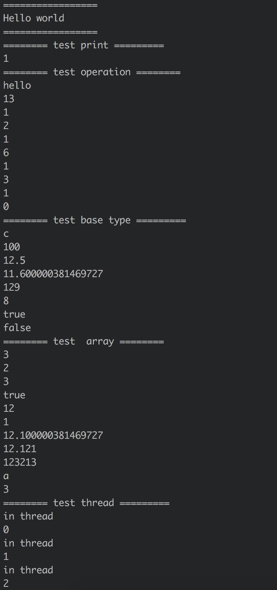

### Zvm 

#### 简介
一款 python 实现的 "超轻量级" jvm 的实现 (其实就是只实现了主要功能)  
"完美"运行各种姿势的 HelloWorld  

#### 如何使用
方法一:  
1. 在 test 目录下新建 .java 文件，可参考 Main.java (因为重写了一些 jdk，所以需要在这个目录下编译，为什么重写 jdk，因为 jdk 中很多 native 方法，这次又没有实现 native 方法，so sad)
2. javac 编译
3. 在 Zvm 目录下运行 python3 Zvm.py test/Main

方法二:  
直接工程导入 pycharm 运行 test.py 吧

#### 主要实现部分
class 文件解析  
类加载  
运行时数据区  
指令解释器  
基本指令集 (总共 205 条，实现了估计 190 多条吧)  
简易 gc   
简易线程  
简易 jdk 库  

#### 可用功能
基本运算 (加减乘除与或位移...)  
输出  
多线程运算 (但是没有加同步)  
类加载，继承，多态  
数组操作 (只支持一维数组)  
gc (模拟 gc)  
异常处理  

#### TODO
代码整理  
方法分派采用 vtable  
interface  
多维数组  
native 方法  
方法，变量验证  
class_loader 读取 jar zip 文件   

#### 参考资料
<java 虚拟机规范>  
<揭秘 java 虚拟机>
<HotSpot 实战>
<自己动手写 java 虚拟机>
...

#### 运行展示

#### LAST
enjoy it
